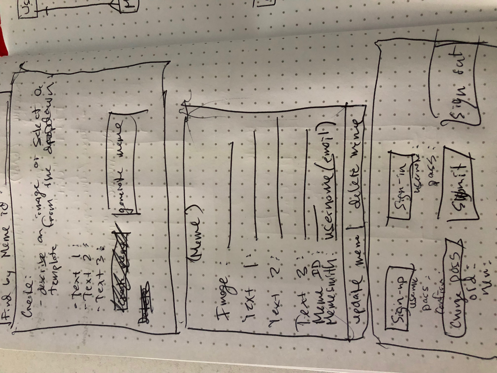

# Bazaar Memes: GA Project 2

This application allows a user to sign up for an account and generate memes to share with users from around the world. Select from a meme template, or use your own image. View memes from other users, comment and up/down vote them. View all your memes and see what others have to say about them.

### Technologies Used:

  -Core web technologies: HTML, CSS, JavaScript.

  -Handlebars used to display memes with comments, upvote information, and functional input to update, delete, create a comment, and up/down vote each meme.

  -jQuery used for DOM manipulation.

  -AJAX used for api requests.

  -Bootstrap used to aid styling and layout.

  -Animate.css used for basic animations to display user messages.

### Important Links:

  Deployed API: https://dashboard.heroku.com/apps/rocky-atoll-42611

  Deployed client: https://asooge.github.io/bazaarMemes/

### Planning and development process:
  Began planning with a basic wireframe for the general layout of the page. I wanted to start with a simple design that was easy for the user to learn how to use the page. Once I had the wireframes, I began work on how I would display the memes using only html and css. I wanted the memes to be responsive to the size of the page, but also to have the same look and proportions no matter what size. Once I had the css to display a meme the way I wanted, I was confident in moving forward I could display any meme given the image url, top text, bottom text, and top and bottom text size.

  Now that I had the 'blueprint' to display the meme, I needed to create a meme generator interface, and I wanted the user to be able to see what their meme would look like, before generating the meme. To do this, I used the 'blueprint' to display or preview the meme, and I made a form for the user to input each necessary piece of information. Next, I made the preview response by adding event listeners to each input, so when the user made any change to the input, it would run a function to update the preview accordingly. This way, the user can see their updates in real time. Once satisfied with the appearence, they can submit the form which triggers a POST request with the input information, creating their meme.

  Now that the meme generator was functional, I needed a way to display the memes on the page. I used handlebars to iterate through the memes array and create html to display each meme, plus additional html to delete and update the meme. I assigned a data-id = meme.id to the inputs and buttons so the app would know which meme the user is interacting with for delete or update. I was able to associate the update inputs with the correct meme so that the changes could be previewed in real time, prior to finalizing the update.

  With the functionality to Create, Read, Update, and Delete a meme completed, I began to add features for comments and upvotes. Similiar to memes, I used handlebars to iterate through the comments array and display each comment. Upvotes were displayed with a background-color style if they were voted on, so the user could see which memes they upvoted and downvoted.

  Finally, I added a feature to sort by most comments, most (net) upvotes, and most recent, and revised styling and layout to improve user experience.

### User Stories:

1) As a user I want to be able to sign in and create a meme.

2) As a user I want to be able to preview my meme before creating it.

3) As a user I want to be able to view all memes I have created and update and delete them as I see fit.

4) As a user I want to be able to see memes from all other users and comment and vote on them as I see fit.

5) As a user I want to be able to see other user's comments on my memes and net upvote/downvotes.

6) As a user, I would like full functionality and intuitive layout on both desktop and mobile.

### Unsolved problems to fix in future iterations:

  Originally would have liked to use and save image files for memes and meme templates, but this would have required a different approach, and integration with an image server for storing memes and html canvas for generating memes. Perhaps a future generation of the app will use image files rather than image-urls. That being said, I was pleased with what I could produce with just html and css styling of text over an image url, and this approach allows for dynamic updating of memes, perhaps in a way that would not be so easily achieved with saved image files.

  Another possible problem I would fix in a future iteration is the number of memes displayed on the page. Currently my meme database is very small (less than 100 memes) so there is no problem, but if the database were to grow to hundreds or even thousands of memes, there could be a problem with displaying a very large number of memes on the page. To fix this, my approach would be to display just 100 memes at a time. If the user scrolls all the way to the bottom and would like to see more, they could click on a button or link that would show them the next 100 memes.

  Another feature I would like to add, is to expand the meme-templates by coding them into a JavaScript object, rather than options in the html input. This approach would allow it to scale easily by simply adding key value pairs to the object with the key being the name of the meme, and the value being the image url. Then to run a function on load that adds these templates to the DOM. This function would also have to run on any get request (using handlebars) so all meme-templates would be available to update each meme. Finally, I would create another function to display a random meme from the meme templates as the default meme on load. If the user refreshed the page, the app would select a new random meme template to display rather than the hard-coded 'grumpy cat' meme template.

### Wireframes:

